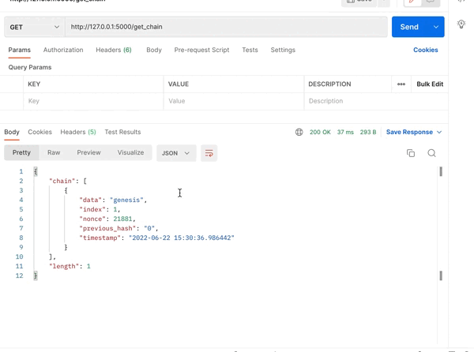

# my-blockchain

Olá pessoal!

Essa é uma implementação simples de blockchain utilizando python.

- Criação do Bloco Genesis;
- Criação de HASH sha256 usando lib "hashlib"
- Método de Mineração do bloco modificando o nonce como acontece na prática

De maneira bem simples:
O Blockchain é simplesmente uma lista de blocos com parâmetros específicos.
O que possibilita a criação de um novo bloco é encontrar a hash dentro de um determinado requisito.
Como o requisito que escolhi é que a hash do bloco tenha 4 zeros nos dígitos iniciais, um laço busca o nonce mais próximo para resolver o problema.

O intuito desse projeto foi apenas demostrar e praticar os conceitos da tecnologia blockchain.

